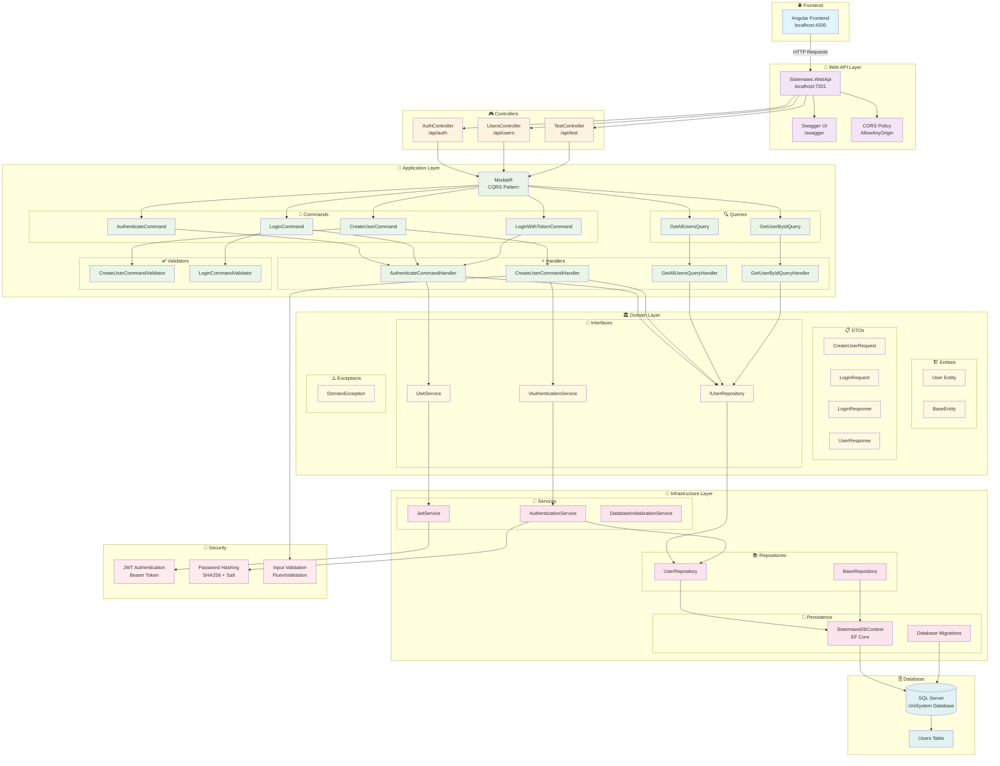

# 🏗️ Diagrama de Arquitetura - Sistemaws Web API

## 📊 Arquitetura Atualizada



## 🔄 Fluxo de Requisições

### **1. Autenticação**
```
Frontend → POST /api/auth/authenticate → AuthController → AuthenticateCommand → AuthenticateCommandHandler → UserRepository → Database
```

### **2. Criação de Usuário**
```
Frontend → POST /api/users (com token) → UsersController → CreateUserCommand → CreateUserCommandHandler → UserRepository → Database
```

### **3. Listagem de Usuários**
```
Frontend → GET /api/users (com token) → UsersController → GetAllUsersQuery → GetAllUsersQueryHandler → UserRepository → Database
```

## 🎯 Endpoints Disponíveis

| Método | Endpoint | Autenticação | Autorização | Descrição |
|--------|----------|--------------|-------------|-----------|
| POST | `/api/auth/authenticate` | ❌ | ❌ | Gerar token JWT |
| POST | `/api/auth/reset-admin-password` | ❌ | ❌ | Resetar senha do admin |
| POST | `/api/users` | ✅ | ✅ Admin | Criar usuário |
| POST | `/api/users/create-without-token` | ❌ | ❌ | Criar usuário sem token |
| GET | `/api/users` | ✅ | ❌ | Listar usuários |
| GET | `/api/users/{id}` | ✅ | ❌ | Buscar usuário por ID |
| GET | `/api/test/test-auth` | ✅ | ❌ | Teste de autenticação |

## 🔐 Configurações de Segurança

- **JWT Key**: Configurável via `appsettings.json`
- **Expiração**: 24 horas
- **Algoritmo**: HS256
- **CORS**: Permitido para desenvolvimento
- **Hash de Senha**: SHA256 + Salt único

## 🗄️ Banco de Dados

- **Tipo**: SQL Server
- **Nome**: UniSystem
- **Criação**: Automática na primeira execução
- **Migrações**: Entity Framework Core
- **Tabela Principal**: Users

## 📊 Tecnologias Utilizadas

- **.NET 8**: Framework principal
- **ASP.NET Core Web API**: Runtime da API
- **Entity Framework Core**: ORM
- **MediatR**: CQRS Pattern
- **FluentValidation**: Validação
- **Swagger/OpenAPI**: Documentação
- **JWT Bearer**: Autenticação


